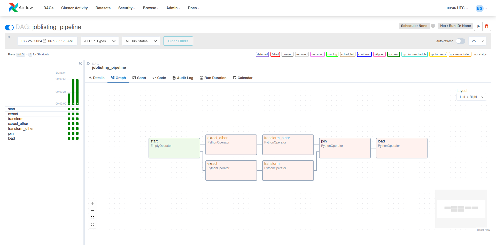

# Data Orchestration in Airflow

Apache Airflow® is an open-source platform for developing, scheduling, and monitoring batch-oriented workflows. Airflow’s extensible Python framework enables you to build workflows connecting with virtually any technology. A web interface helps manage the state of your workflows. Airflow is deployable in many ways, varying from a single process on your laptop to a distributed setup to support even the biggest workflows.  
**Code Snippet*
```
default_args={‘Owner’ : ‘gwayi’}
@dag(
dag_id=”jobs_listing”, # unique identifier
default_args=default_args, # default arguments
schedule=@daily, # how often the dag runs
start_date=datetime(2024, 7, 20), # start date for the dag
catchup=False, # run/not run missed intervals
tags=['Team A'], # to categorize and filter dags in UI
)
```


[job_lisitng pipeline](https://github.com/BrianGwayi/Simple_Airflow_Pipeline)
[adventure_works](https://github.com/BrianGwayi/Apache-Airflow)

Apache Airflow® is an open-source platform for developing, scheduling, and monitoring batch-oriented workflows. Airflow’s extensible Python framework enables you to build workflows connecting with virtually any technology. A web interface helps manage the state of your workflows. Airflow is deployable in many ways, varying from a single process on your laptop to a distributed setup to support even the biggest workflows  

**Tech stack used:** PostgreSQL Database, Python Version 3.12, Apache Airflow

## Set up PotgreSQL Database - connection via Terminal
```
Command: sudo sudo -u postgres psql
Output: [sudo] password for gwayi:
# Enter password
Output: postgres=#
# Enter SQL statement to create database
SELECT 'CREATE DATABASE listing_db' 
WHERE NOT EXISTS (SELECT FROM pg_database WHERE datname = 'listing_db')\gexec
CREATE DATABASE
# Note: PostgreSQL does not support IF NOT EXIST

```

## **Instantiate a DAG**
```
default_args={‘Owner’ : ‘gwayi’}
@dag(
dag_id=”jobs_listing”, # unique identifier
default_args=default_args, # default arguments
schedule=@daily, # how often the dag runs
start_date=datetime(2024, 7, 20), # start date for the dag
catchup=False, # run/not run missed intervals
tags=['Team A'], # to categorize and filter dags in UI
)
```
```
def _taskflow_api_():
    # Task 1 - Extract
    @task
    def extract():
        response = requests.get("https://www.myjobmag.co.ke/aggregate_feed.xml")
        xml_feed = xmltodict.parse(response.text)
        return xml_feed['rss']['channel']['item']
```
```
    # Task 2 - Transform
    @task
    def transform(val):
        #response = ti.xcom_pull(task_ids="extract")
        #logging.info(response)
        #print(val)
        tf = pd.DataFrame(val)
        return tf.astype({'id':'int64','pubDate':'datetime64[ns]'})
```
```
# Task 3 - Load
 @task
    def load(new_val):
        # Establish a connection to your PostgreSQL database
        conn = psycopg2.connect(
            database='jobs_pipelines',
            user='postgres',
            password='p@ssword',
            host='127.0.0.1',
            port='5432'
            )
        with conn.cursor() as cursor:
            x = new_val.to_dict(orient="records")
            execute_values(conn, new_val, 'listing')
            conn.commit()

    val = extract()
    new_val = transform(val)
    load_val = load(new_val)
_taskflow_api_ = _taskflow_api_()
```



- [Code](https://github.com/BrianGwayi/Apache-Airflow/blob/main/taskflow_api.py)
- [full Documentation](https://github.com)

**Use case:** Designing and Implementing Retail Data Warehouse  
**Tech stack used:** Lucid Chart, AWS Redshift
- Identify business process - sales in a retail company.
- Identify the grain - line item per order.
- identify the dimension - customer, store, product, date...
- identify the facts - price per unit,cost per unit, quantity..
- [sql code](https://github.com) [Details(https://github.com]


- Data Management
- - Database Management
Kimball's Data Warehouse Design 
  - DBaas - (AWS, Oracle, Azure)
- Reporting


- Visualisation
- Forecasting and predictive Analysis
- taskflow_api.py

### Tech Stack
- Databases:Oracle 9I/10g, DB2, PostgreSQL, MySQL, SQL Server
- Reporting:Power BI,Tableau, Looker
- Orchestration and Integration: Kafka, Airflow,Talend
- Languages: Python, Unix Shell Script, SQL and PL/SQL

# Data Specialist
### Education
Business Information Technology, Bsc

### Work Experience
Data Lead @ Afriama  
Business Intelligence Analyst @ Absa Bank   
Officer Credit Operation @ Co-operative Bank  
Data Entry Freelancer @ Jumia Food 
