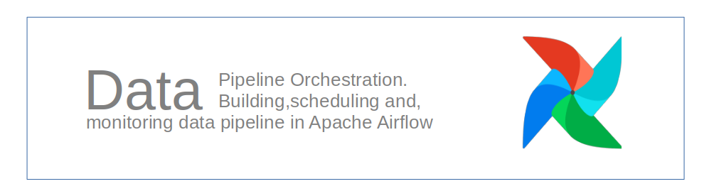
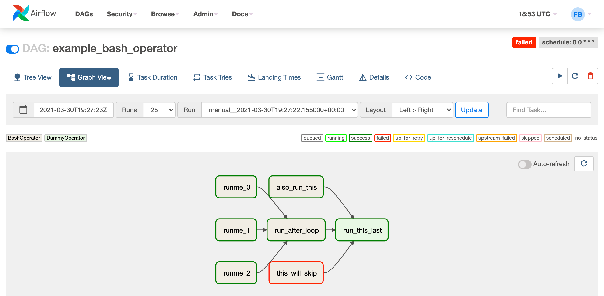

# Data Orchestration in Airflow

Apache Airflow® is an open-source platform for developing, scheduling, and monitoring batch-oriented workflows. Airflow’s extensible Python framework enables you to build workflows connecting with virtually any technology. A web interface helps manage the state of your workflows. Airflow is deployable in many ways, varying from a single process on your laptop to a distributed setup to support even the biggest workflows.  
## *Code Snippet*
```
default_args={‘Owner’ : ‘gwayi’}
@dag(
dag_id=”jobs_listing”, # unique identifier
default_args=default_args, # default arguments
schedule=@daily, # how often the dag runs
start_date=datetime(2024, 7, 20), # start date for the dag
catchup=False, # run/not run missed intervals
tags=['Team A'], # to categorize and filter dags in UI
)
```


[job_lisitng pipeline](https://github.com/BrianGwayi/Simple_Airflow_Pipeline)  
[adventure_works](https://github.com/BrianGwayi/Apache-Airflow)

# Reporting - Dashboard Development
## Microsoft Power BI

### Tech Stack
- Databases:Oracle 9I/10g, DB2, PostgreSQL, MySQL, SQL Server
- Reporting:Power BI,Tableau, Looker
- Orchestration and Integration: Kafka, Airflow,Talend
- Languages: Python, Unix Shell Script, SQL and PL/SQL

# Data Specialist
### Education
Business Information Technology, Bsc

### Work Experience
Data Lead @ Afriama  
Business Intelligence Analyst @ Absa Bank   
Officer Credit Operation @ Co-operative Bank  
Data Entry Freelancer @ Jumia Food 
