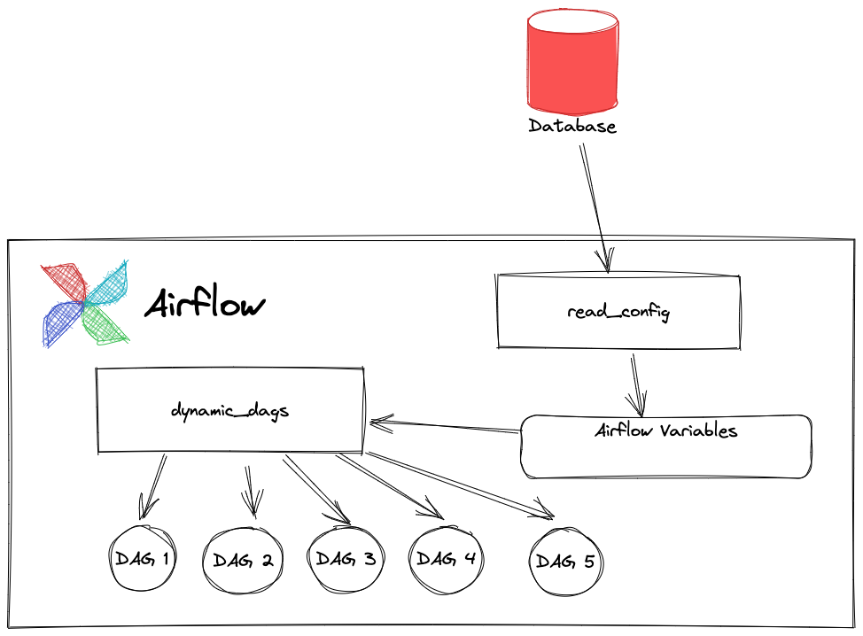
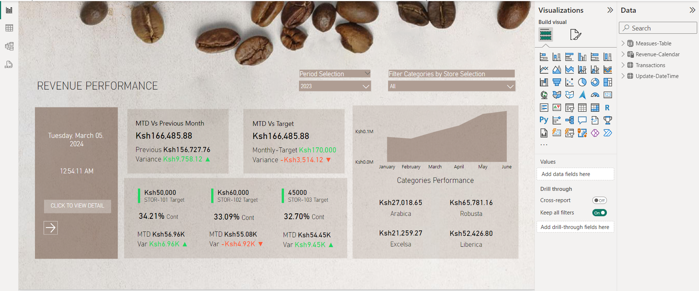

# Data Specialist
### Education
Business Information Technology, Bsc

### Work Experience
Data Lead @ Afriama  
Business Intelligence Analyst @ Absa Bank   
Officer Credit Operation @ Co-operative Bank  
Data Entry Freelancer @ Jumia Food  
### Big Impact Projects

Apache Airflow® is an open-source platform for developing, scheduling, and monitoring batch-oriented workflows.  
Airflow’s extensible Python framework enables you to build workflows connecting with virtually any technology.  
A web interface helps manage the state of your workflows. Airflow is deployable in many ways, varying from a  
single process on your laptop to a distributed setup to support even the biggest workflows  
**Use case:** Programatically build data pipeline in Apache Airflow + Python  
**Tech stack used:** PostgreSQL Database, Python Version 3.12, Apache Airflow

- [project code](https://github.com/BrianGwayi/Apache-Airflow/blob/main/taskflow_api.py)
- [full description](https://github.com)

**Use case:** Designing and Implementing Retail Data Warehouse  
**Tech stack used:** Lucid Chart, AWS Redshift
- Identify business process - sales in a retail company.
- Identify the grain - line item per order.
- identify the dimension - customer, store, product, date...
- identify the facts - price per unit,cost per unit, quantity..
- [sql code](https://github.com) [Details(https://github.com]

- Data Management
- - Database Management
Kimball's Data Warehouse Design 
  - DBaas - (AWS, Oracle, Azure)
- Reporting

- Visualisation
- Forecasting and predictive Analysis
- taskflow_api.py

### Tech Stack
- Databases:Oracle 9I/10g, DB2, PostgreSQL, MySQL, SQL Server
- Reporting:Power BI,Tableau, Looker
- Orchestration and Integration: Kafka, Airflow,Talend
- Languages: Python, Unix Shell Script, SQL and PL/SQL
